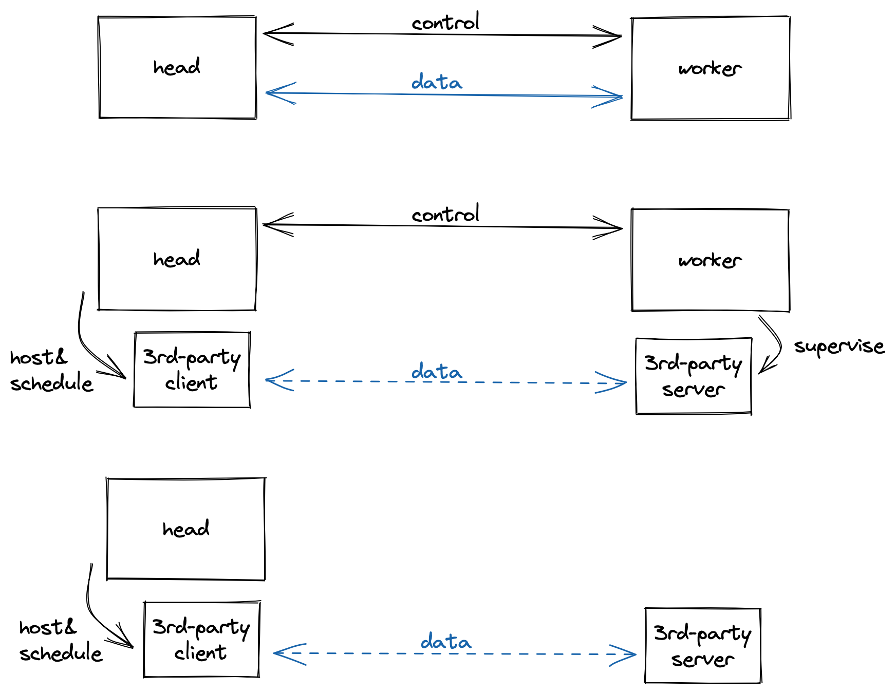

Specialized worker: bring your own server
=========================================

.. note::

   This is a topic for tasklet developers.
   Specialized worker is intended to cover scenario where implementing a tasklet that runs on workers seems an overkill.
   To see if you need to implement a specialized worker, check out :ref:`the decision chart in the next section<do-i-need-sworker>`.

In the original Grain head-worker model,
the head-worker communication handles two types of messages:
data transfer (function params & return values) and control signal (worker info, shutdown, job canceling, etc.)
There are tasklets working in a more sophisticated way, though, that they might have their own protocol for data transfer,
or even manage their own server life cycles.
Thus, the specialized worker modes provide a way to bypass the default behaviors of data transfer and process management.
The diagram below is a comparison of the three head-worker modes:

   How each type of worker works with head.
   From top to bottom: original, specialized worker, backendless specialized worker

.. _do-i-need-sworker:

Do I need a specialized worker?
-------------------------------

- Do you need to run your Python function (that e.g. initiates a computation and reads the result) at the same place where your resources are located?

  - Yes: You only need to write a tasklet.
  - No: Do you run the worker / server process yourself?

    - Yes: You need to implement a specialized worker.
    - No: You need to implement a backendless specialized worker.

An example specialized worker: you set up a listening process, and control it via its own client library

An example backendless specialized worker: you access a service on cloud platform via its own client library

Implement a specialized worker
------------------------------

First, choose a namespace for your specialized worker.
An example module layout is shown below:

.. code-block:: none

   pyproject.toml
   cool_package/__init__.py
   cool_package/the_sworker.py

where ``cool_package/the_sworker.py`` is the namespace or entry point for your specialized worker implementation.

Let's see what should be included in ``cool_package/the_sworker.py``:

1. ``GRAIN_SWORKER_CONFIG``: a config dictionary.

.. code-block:: python

   # It could be empty
   GRAIN_SWORKER_CONFIG = dict()
   # ... or if you are implementing a backendless specialized worker, use the following
   GRAIN_SWORKER_CONFIG = dict(BACKENDLESS=True)

2. ``grain_run_sworker``: an async context manager to run a server instance on the worker side.
   (For backendless specialized worker, this runs on the head side.)

.. code-block:: python

   from contextlib import asynccontextmanager

   @asynccontextmanager
   async def grain_run_sworker():
       # set up server
       yield dict(
           name="unique_ID_for_each_worker_instance", # accessible via `GVAR.instance`
           ... # additional fields are passed to the corresponding `grain_context`
       )
       # clean up server

3. ``grain_context``: an async context manager to run a client instance on the head side.
   This starts running after ``grain_run_sworker`` yields.

.. code-block:: python

   from contextlib import asynccontextmanager

   @asynccontextmanager
   async def grain_context(**kwargs):
       # `kwargs`, if any, are received from the corresponding `grain_run_sworker`
       client = ... # set up client
       yield client # pass client instance to tasklet, accessible via `GVAR.context`
       # clean up client

Both async context managers are executed every time a worker instance is created.
You should also have a corresponding tasklet implementation that makes use of the client instance from ``GVAR.context``.

Teach users about your specialized worker
-----------------------------------------

Assumed that you have asked your tasklet users to install the package you implemented in the previous section.
You can then tell them to add the following entry to their Grain configs:

.. code-block:: toml

   [worker]
   specialized_type = "cool_package.the_sworker"

This will switch Grain from default head-worker mode to your specialized worker mode.
And the users can use your tasklet as usual, along with other Grain features (e.g. resource binding).
